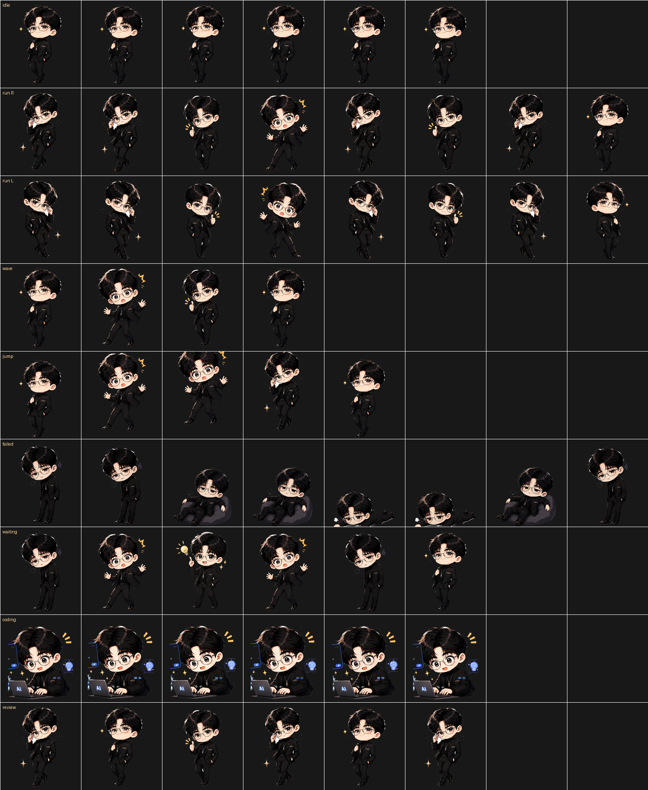

# SinKry Codex Pet

SinKry is a custom Codex pet package with expressive idle, running, waiting, review, and coding states.

Version `v1.2` changes long idle behavior to a static lazy mode: SinKry stays slouched or lying down with only a tiny breathing motion, closer to the QQ Pet style.



## Preview

| Static lazy idle | Lying waiting | Coding |
| --- | --- | --- |
|  |  |  |

## Install

Run the installer from this repository:

```bash
./install.sh
```

Then restart Codex if the old pet image is still cached.

## Package

The Codex pet package lives in `sinkry/`:

- `sinkry/pet.json`
- `sinkry/spritesheet.webp`

The spritesheet follows the Codex pet atlas format: 1536 x 1872 pixels, 8 columns, 9 rows, 192 x 208 pixels per frame.
